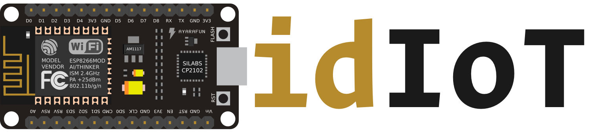

---
idIoT is an IoT environment based on [NodeMCU + ESP8266](http://nodemcu.com/index_en.html).
NodeMCU is an open-source firmware and development kit that helps 
you to prototype your IoT product within a few Lua script lines.

**idIoT** tries to make **NodeMCU** environment easier to develop using
MoonScript and the **idiot framework**.

## Overview

idIoT uses **MoonScript** to make coding easier for NodeMCU development.

**Writing a blinking LED is _THAT_ easy:**
```moonscript
every second!, -> toggle pin 4
```

**Or listening a button press:**
```moonscript
led = pin 0
on button(5), (pressed)-> toggle led, to: pressed
```

**Or you can descriptively create a buzzer beeper:**
```moonscript
buzzer = pin 1
beep = -> close pin 1, for: seconds(1)
```

## Install (OS X Development Environment)

### 1. Download Driver
First, you need to download [SiLabs Serial Driver](https://www.silabs.com/Support%20Documents/Software/Mac_OSX_VCP_Driver.zip)
to connect, send and receive data from/to NodeMCU.

### 2. Install Dependencies
```bash
brew install lua      # Install Lua via Homebrew
sudo easy_install pip # You need to have Python PIP
pip install esptool   # Install ESPTool to interact with NodeMCU
luarocks install moonscript --local # Install MoonScript
```

### 3. Download idIoT

idIoT is where the magic starts:

```bash
git clone http://github.com/f/idiot.git
cd idiot
make install
```

## Firmware


### Enabled Modules
`cjson` `cron` `encoder` `enduser_setup` `file` `gpio`
`mdns` `net` `node` `tmr` `uart` `websocket` `wifi`

To bundle more modules, please use [NodeMCU Builder](https://nodemcu-build.com).

**_Please replace `firmware/firmware.bin` with if you build custom firmware._**

### Install Firmware

Run following command to install new firmware.

```bash
make reset
```
### Upload Code

```bash
make
```

## API

Idiot has simplified API to take control of your board.

### Timer

#### `every delay, function`

```moonscript
every second!, -> toggle pin 4
```

#### `wait delay, function`

```moonscript
wait second!, -> open pin 4
```

### `second`

```moonscript
second! -- 1 second
second(0.5) -- half second
second 2 -- 2 seconds
```

## License

MIT
